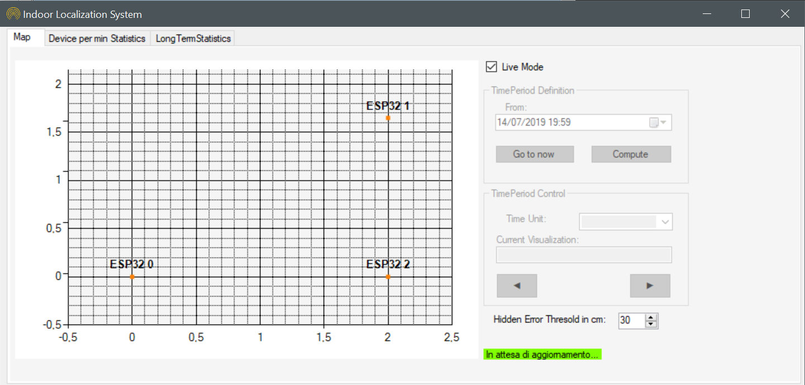

# esp32_indoor_localization_2.0

Project for __System and Device Programming__ course, focused on develop an indoor geolocalization system using ESP32 hardware. Presentation of project's rule are enlisted <a href="https://github.com/BreakSecurity/esp32-indoor-localization/blob/master/EXTRA/Progetto%20del%20corso.pdf">here</a>.

We used Espressif IoT Development Framework . ESP-IDF is the official development framework for the [ESP32](https://espressif.com/en/products/hardware/esp32/overview) chip.

We developed a framework based on __C# front-end interface__ and __NOSQL databases__ for information storage. SoC development is based on __C__/__C++__ languages. 

## Preview

## Usage
Download and 
PSW = 'vaccarino' 
per cambiarla basta cambiare il valore di std_password con uno generato da https://www.xorbin.com/tools/sha256-hash-calculator
